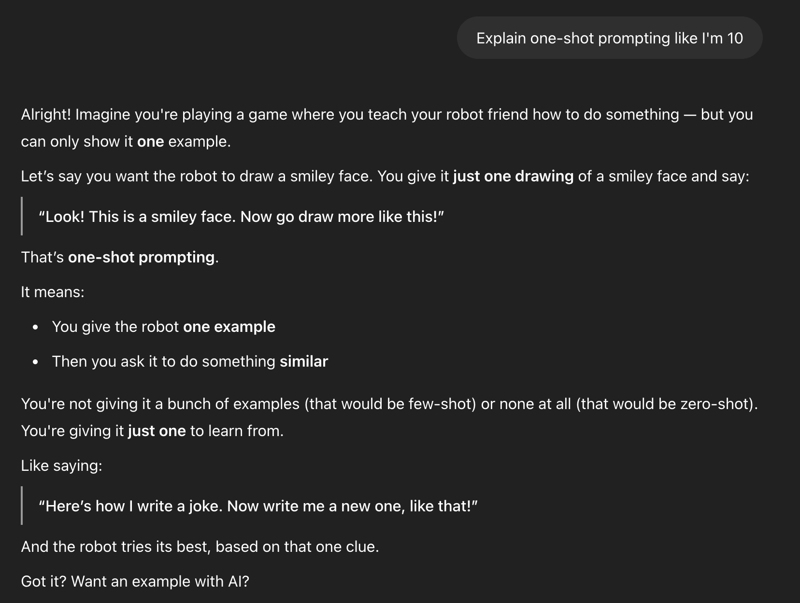

## What Is LangChain?

LangChain is an open-source framework designed to help developers build applications powered by LLMs. It provides tools to structure LLM interactions, manage memory, integrate APIs, and create complex workflows.

## Benefits of LangChain

- Simplifies handling prompts and responses
- Supports multiple LLM providers (OpenAI, Hugging Face, Anthropic, etc.)
- Enables memory, retrieval, and chaining multiple AI calls
- Supports building chatbots, agents, and AI-powered apps

## Why Langchain Framework?

Large language models (LLMs) like OpenAI’s GPT-4 and Hugging Face models are powerful, but using them effectively in applications requires more than just calling an API. LangChain is a framework that simplifies working with LLMs, enabling developers to create advanced AI applications with ease.

## Create and Setup `venv` in langchain

#### 1. create a `venv` using conda

```
conda create -p venv python==3.11 -y
```

#### 2. create a `requirements.txt`

- langchain
- ipykernel

#### 3. install your packages in `requirements.txt`

```
pip install -r requirements.txt
```

#### 4. confirm if a package is installed

```
pip list | findstr "name_of_package"
```

#### 5. activate the `conda environment`

```
conda activate venv
```

### LLM FAQs


